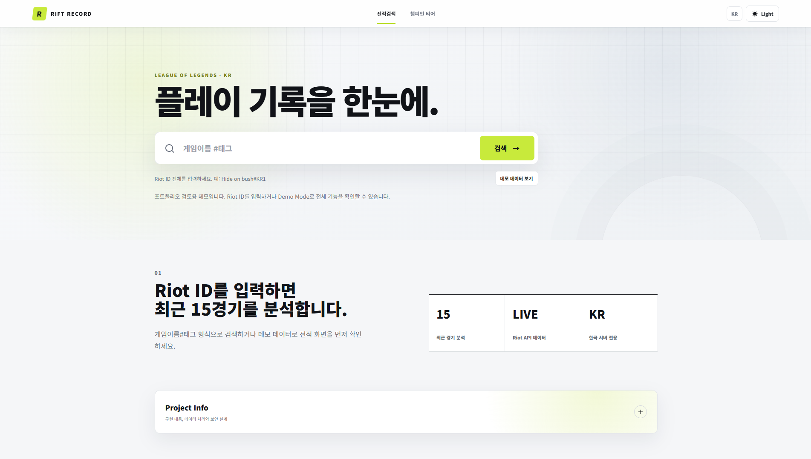

# Rift Record

Riot Games API를 활용해 **League of Legends와 Teamfight Tactics 전적을 한 화면에서 조회하고 분석하는 반응형 웹 서비스**입니다.

Riot ID를 검색하면 소환사의 협곡 랭크와 최근 15경기, TFT 랭크와 최근 10경기를 각각 확인할 수 있습니다. 실제 검색이 어려운 환경에서도 UI와 분석 흐름을 검토할 수 있도록 Demo Mode를 제공합니다.

[배포 사이트](https://rift-record.vercel.app/) · [Demo Mode](https://rift-record.vercel.app/?demo=true)



## 프로젝트 목표

- 검색 직후 프로필, 티어, 핵심 지표와 최근 게임을 빠르게 확인할 수 있는 정보 구조
- LoL과 TFT 데이터를 섞지 않고 게임 탭으로 명확하게 분리
- 단순 전적 나열을 넘어 최근 경기 흐름과 개선 방향을 전달하는 분석 경험
- 라이트·다크 테마와 PC·태블릿·모바일을 모두 고려한 반응형 UI
- API Key와 데이터베이스 권한을 브라우저에 노출하지 않는 서버 중심 설계

## 주요 기능

### 소환사의 협곡

- Riot ID 기반 프로필, 소환사 레벨, 대표 챔피언 조회
- 솔로 랭크와 자유 랭크 티어, LP, 승패, 승률 표시
- 최근 15경기 승률, 평균 KDA, 킬 관여율, 평균 CS, 주 포지션 요약
- 최근 게임을 전체, 솔로랭크, 자유랭크 5대5, 일반, 칼바람으로 필터링
- 챔피언, KDA, 룬, 아이템, CS, 피해량, 킬 관여율을 매치 카드로 표시
- 상세보기에서 양 팀 참여자와 경기 분석 코멘트 제공
- 참여자 Riot ID 클릭 시 새로고침 없이 해당 플레이어 전적 검색
- 플레이스타일, 경기 하이라이트, 챔피언·포지션 성과, 추천픽, 최근 흐름, 개선 포인트 분석
- 상세 분석은 기본적으로 접어 최근 게임 목록을 우선 노출

### LP 추적

Riot Match API는 과거 경기별 LP 증감을 제공하지 않습니다. Rift Record는 같은 사용자를 다시 검색했을 때 저장된 랭크 스냅샷과 현재 값을 비교해 **검색 시점 사이의 LP 변화**를 추적합니다.

- 추적 전: `LP 추적 전`
- 비교 가능: 최근 LP 변화량 표시
- 경기별 정확한 LP 변화로 오해되지 않도록 임의 값을 생성하지 않음

### 롤토체스

- LoL 검색 결과의 Riot ID를 ACCOUNT-V1으로 다시 확인한 뒤 TFT 데이터 조회
- 별도 `TFT_API_KEY`를 사용하는 TFT 전용 백엔드 라우트
- TFT 티어, LP, 승패, 승률 표시
- 최근 10경기 평균 등수, Top 4 비율, 1등 횟수, 평균 레벨 요약
- 등수, 레벨, 최종 라운드, 특성, 유닛, 증강체 중심의 가로형 경기 카드
- Data Dragon `ko_KR` 데이터를 이용한 유닛, 특성, 증강체, 아이템 한글화
- 유닛 초상화, 성급, 아이템 아이콘과 상세보기 제공
- TFT 랭크 조회가 실패해도 최근 매치 조회는 독립적으로 처리

### 사용자 경험

- 기본 라이트 테마와 차분한 다크 테마
- 선택한 테마를 `localStorage`에 저장
- 최근 검색과 즐겨찾기 Riot ID를 브라우저에 최대 5개 저장
- 검색 결과 공유 URL과 새로고침 시 자동 검색
- 로딩 스켈레톤과 단계별 오류 메시지
- 모바일 카드 재배치, 필터 줄바꿈, 터치 영역 최적화
- 프로젝트 구현 내용을 별도의 Project Info 영역으로 분리

### 자체 챔피언 티어

Supabase에 수집된 솔로 랭크 참가자 데이터를 기반으로 포지션별 챔피언 지표를 계산합니다.

```text
tierScore =
normalizedWinRate * 0.55
+ normalizedPickRate * 0.25
+ normalizedKDA * 0.10
+ sampleConfidence * 0.10
```

점수 순으로 S/A/B/C/D 등급을 부여하며, 10경기 미만 표본은 `Low Sample`로 표시합니다.

> 이 티어는 Riot Games 공식 티어가 아닙니다. Rift Record가 수집한 제한된 표본으로 계산한 포트폴리오용 참고 지표입니다.

## 기술 구성

| 구분 | 기술 |
| --- | --- |
| Frontend | HTML5, CSS3, Vanilla JavaScript |
| Backend | Node.js, Vercel Serverless Functions |
| Database | Supabase PostgreSQL |
| LoL API | ACCOUNT-V1, SUMMONER-V4, LEAGUE-V4, MATCH-V5, CHAMPION-MASTERY-V4 |
| TFT API | TFT-SUMMONER-V1, TFT-LEAGUE-V1, TFT-MATCH-V1 |
| Static Data | Riot Data Dragon, TFT Data Dragon `ko_KR` |
| Deployment | GitHub, Vercel |

프레임워크 없이 브라우저 기본 API와 JavaScript 모듈을 사용했습니다. Grid, Flexbox, Media Query로 반응형 레이아웃을 구성하고 `localStorage`로 테마, 최근 검색, 즐겨찾기와 랭크 스냅샷을 관리합니다.

## 데이터 흐름

```text
Riot ID 입력
  └─ ACCOUNT-V1 → account.puuid
      ├─ LoL API → 프로필 / 랭크 / 숙련도 / 최근 매치
      │   └─ 매치 저장 → Supabase → 자체 챔피언 티어 계산
      └─ TFT API → TFT 소환사 / 랭크 / 최근 10경기
          └─ TFT Data Dragon → 한국어 이름과 이미지 매핑
```

LoL과 TFT는 API Key, 요청 경로, 응답 가공 로직을 분리했습니다. TFT 데이터는 기존 LoL `matches`, `participants` 테이블에 저장하지 않습니다.

## 프로젝트 구조

```text
rift-record/
├─ api/                    # Vercel Serverless Function 진입점
├─ public/
│  ├─ assets/ranked/       # 랭크 티어 이미지
│  ├─ app.js               # 화면 상태, 검색, 렌더링, 인터랙션
│  ├─ favicon.svg
│  ├─ index.html
│  └─ styles.css
├─ src/
│  ├─ api-core.mjs         # LoL/TFT API 라우팅과 응답 가공
│  ├─ match-store.mjs      # 매치 저장 및 통계 데이터 접근
│  └─ supabase-server.mjs  # 서버 전용 Supabase 클라이언트
├─ supabase/schema.sql
├─ docs/
│  ├─ assets/rift-record-preview.png
│  └─ riot-api-key-application.md
├─ server.mjs              # 로컬 개발 서버
└─ vercel.json
```

## 환경변수

루트에 `.env`를 만들고 다음 값을 설정합니다.

```env
RIOT_API_KEY=
TFT_API_KEY=
SUPABASE_URL=
SUPABASE_SERVICE_ROLE_KEY=
NODE_ENV=development
```

- `RIOT_API_KEY`: 소환사의 협곡 API 호출
- `TFT_API_KEY`: TFT API와 TFT용 ACCOUNT-V1 호출
- `SUPABASE_SERVICE_ROLE_KEY`: 서버에서만 사용하는 데이터 저장 권한

API Key와 Service Role Key는 서버 환경변수에서만 읽습니다. `.env`, `.env.local`, `data/*.json`과 실행 로그는 Git에서 제외됩니다.

## 로컬 실행

Node.js 20 이상이 필요합니다.

```bash
npm install
npm run dev
```

기본 주소는 `http://127.0.0.1:4173`입니다.

```text
실제 검색: http://127.0.0.1:4173/?riotId=Hide%20on%20bush&tag=KR1
Demo Mode: http://127.0.0.1:4173/?demo=true
```

코드 문법 검사는 다음 명령으로 실행합니다.

```bash
npm run check
```

Supabase 설정이 없으면 로컬 개발 환경에서 `data/matches.json`을 fallback 저장소로 사용합니다. Demo Mode는 Riot API와 Supabase 설정 없이 작동합니다.

## Supabase 설정

1. Supabase 프로젝트를 생성합니다.
2. SQL Editor에서 [`supabase/schema.sql`](supabase/schema.sql)을 실행합니다.
3. Project URL과 Service Role Key를 `.env`에 등록합니다.
4. `/api/health`에서 환경변수 설정 상태를 확인합니다.

| 테이블 | 용도 |
| --- | --- |
| `matches` | `matchId`와 Riot 원본 LoL 매치 JSON |
| `participants` | 챔피언 티어 계산에 필요한 참가자 지표 |
| `champion_stats_cache` | 패치와 포지션별 계산 결과 캐시 |

RLS는 활성화하지만 공개 정책은 만들지 않습니다. Service Role Key는 백엔드 함수에서만 사용합니다.

## Vercel 배포

1. GitHub 저장소를 Vercel에 Import합니다.
2. `RIOT_API_KEY`, `TFT_API_KEY`, `SUPABASE_URL`, `SUPABASE_SERVICE_ROLE_KEY`를 등록합니다.
3. 환경변수 변경 후 Redeploy합니다.
4. `/api/health`에서 `hasRiotApiKey`, `hasTftApiKey`, `hasSupabaseConfig`를 확인합니다.
5. LoL/TFT 검색과 `/api/champion-stats?position=MID` 응답을 확인합니다.

Development API Key는 만료될 수 있습니다. 지속적인 공개 운영에는 Riot Developer Portal의 적절한 API Key 정책을 따라야 합니다.

## 현재 범위와 확장 방향

- 현재 LP 변화는 개별 경기의 정확한 값이 아니라 검색 시점 사이의 변화입니다.
- Demo Mode 데이터는 실제 Riot 계정 데이터가 아닙니다.
- TFT 매치는 조회와 화면 표시만 하며 Supabase에 저장하지 않습니다.
- 운영 서비스로 확장할 경우 사용자 인증, 서버 기반 즐겨찾기, 관리자 기능, 모니터링과 테스트 자동화를 추가할 수 있습니다.

## Riot Games 고지

Rift Record is not endorsed by Riot Games and does not reflect the views or opinions of Riot Games or anyone officially involved in producing or managing Riot Games properties. Riot Games and all associated properties are trademarks or registered trademarks of Riot Games, Inc.
