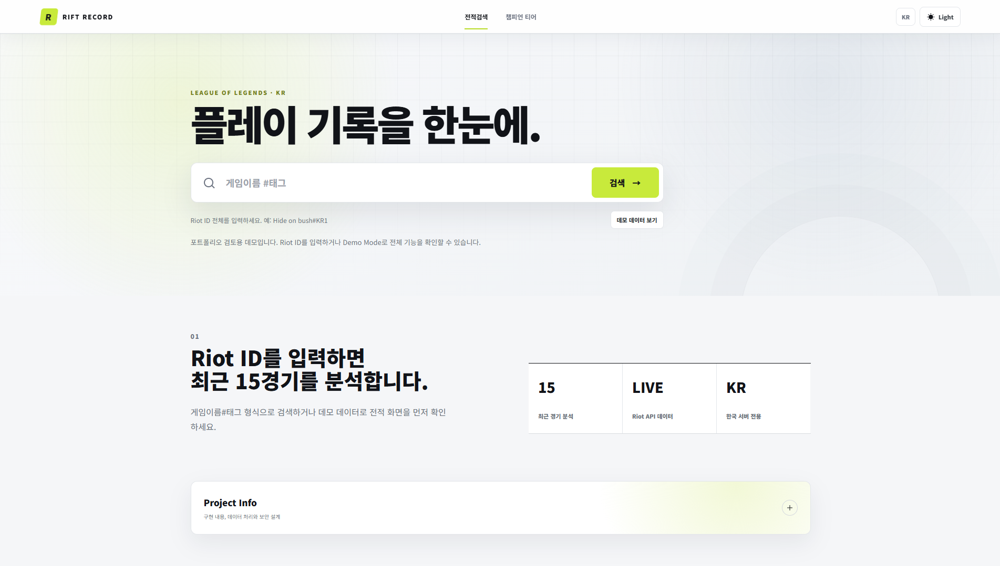

# Rift Record

Riot Games API를 활용해 **League of Legends와 Teamfight Tactics 전적을 한 화면에서 조회하고 분석하는 반응형 웹 서비스**입니다.

Riot ID를 검색하면 소환사의 협곡 랭크와 최근 15경기, TFT 랭크와 최근 10경기를 각각 확인할 수 있습니다. 실제 검색이 어려운 환경에서도 UI와 분석 흐름을 검토할 수 있도록 Demo Mode를 제공합니다.

[배포 사이트](https://rift-record.vercel.app/) · [Demo Mode](https://rift-record.vercel.app/?demo=true)



## 프로젝트 목표

- 검색 직후 프로필, 티어, 핵심 지표와 최근 게임을 빠르게 확인할 수 있는 정보 구조
- LoL과 TFT 데이터를 섞지 않고 게임 탭으로 명확하게 분리
- 단순 전적 나열을 넘어 최근 경기 흐름과 개선 방향을 전달하는 분석 경험
- 라이트·다크 테마와 PC·태블릿·모바일을 모두 고려한 반응형 UI
- API Key와 데이터베이스 권한을 브라우저에 노출하지 않는 서버 중심 설계

## 주요 기능

### 소환사의 협곡

- Riot ID 기반 프로필, 소환사 레벨, 대표 챔피언 조회
- 솔로 랭크와 자유 랭크 티어, LP, 승패, 승률 표시
- 최근 15경기 승률, 평균 KDA, 킬 관여율, 평균 CS/분, 주 포지션 요약
- 최근 게임을 전체, 솔로랭크, 자유랭크 5대5, 일반, 칼바람, 기타 모드로 필터링
- 필터에 맞춰 요약과 상세 분석을 함께 갱신하고 다시하기·조기 종료 기록 제외
- 플레이 경향과 개선 의견은 소환사의 협곡에서 포지션을 확인할 수 있는 5경기 이상일 때 제공
- 추천 챔피언은 주 포지션에서 3경기 이상 플레이한 기록을 사용
- 필터별 경기 수를 함께 표시해 현재 목록 구성을 빠르게 파악
- 챔피언, KDA, 룬, 아이템, CS, 피해량, 킬 관여율을 매치 카드로 표시
- 상세보기에서 양 팀 참여자와 경기 분석 코멘트 제공
- 참여자 Riot ID 클릭 시 새로고침 없이 해당 플레이어 전적 검색
- 플레이스타일, 경기 하이라이트, 챔피언·포지션 성과, 추천픽, 최근 흐름, 개선 포인트 분석
- 상세 분석은 기본적으로 접어 최근 게임 목록을 우선 노출

### LP 추적

Riot Match API는 과거 경기별 LP 증감을 제공하지 않습니다. Rift Record는 같은 사용자를 다시 검색했을 때 저장된 랭크 스냅샷과 현재 값을 비교해 **검색 시점 사이의 LP 변화**를 추적합니다.

- 추적 전: `LP 추적 전`
- 비교 가능: 프로필 랭크 영역에 이전 조회 대비 LP 변화와 비교 시점 표시
- Master/Grandmaster/Challenger는 동일한 LP 축으로 비교하며 시즌 승패 초기화 시 비교를 보류
- 캐시 재조회는 랭크 스냅샷을 중복 갱신하지 않음
- 경기별 정확한 LP 변화로 오해되지 않도록 임의 값을 생성하지 않음

### 롤토체스

- 검색 전에 LoL/TFT를 선택할 수 있으며 TFT는 LoL 조회 없이 독립 검색 가능
- 별도 `TFT_API_KEY`를 사용하는 TFT 전용 백엔드 라우트
- TFT 티어, LP, 승패, 승률 표시
- 최근 10경기 평균 등수, Top 4 비율, 1등 횟수, 평균 레벨 요약
- 모드·세트 필터와 실제 경기 기간 표시. 전체 선택의 요약은 일반·랭크 경기만 사용
- 더블업에 일반 경기의 Top 4 비율을 적용하지 않음
- `last_round`는 API 원본 회차로 표시하며 검증되지 않은 스테이지 변환은 사용하지 않음
- 등수, 레벨, 최종 라운드, 특성, 유닛, 증강체 중심의 가로형 경기 카드
- Data Dragon `ko_KR` 데이터를 이용한 유닛, 특성, 증강체, 아이템 한글화
- 전략가 이미지, 유닛 초상화, 성급, 아이템 아이콘과 상세보기 제공
- 상세보기에서 8명 참가자의 등수, 라운드, 시너지, 유닛, 업적을 압축 테이블로 표시
- 참가자 상세 DOM은 펼칠 때 생성해 초기 렌더링과 이미지 요청을 줄임
- Data Dragon에서 바로 찾기 어려운 소환 유닛은 화면에 `summon` 같은 원본 ID가 노출되지 않도록 표시명 보정
- TFT 랭크 조회가 실패해도 최근 매치 조회는 독립적으로 처리

### 사용자 경험

- 기본 라이트 테마와 차분한 다크 테마
- 선택한 테마를 `localStorage`에 저장
- 최근 검색과 즐겨찾기 Riot ID를 브라우저에 최대 5개 저장
- 검색 결과 공유 URL과 새로고침 시 자동 검색
- 공유 링크 복사와 클립보드 사용 불가 시 주소 선택 대체 동작
- 새 검색·데모 전환 시 이전 요청을 취소하고 늦은 응답이 최신 화면을 덮어쓰지 않도록 검증
- 브라우저 저장이 차단되면 최근 검색·즐겨찾기를 현재 세션 메모리에 보관
- 로딩 스켈레톤과 단계별 오류 메시지
- 모바일 카드 재배치, 필터 줄바꿈, 터치 영역 최적화
- 모바일 상세보기는 표를 그대로 축소하지 않고 참가자별 압축 카드 구조로 재배치
- 프로젝트 구현 내용을 별도의 Project Info 영역으로 분리

### 자체 챔피언 티어

Supabase에 수집된 **현재 패치(major.minor), 최근 28일, 솔로랭크(queue 420), 5분 이상 경기**의 참가자 데이터를 기반으로 포지션별 챔피언 지표를 계산합니다. 로컬 저장소에도 같은 필터를 적용합니다.

```text
tierScore =
normalizedWinRate * 0.55
+ normalizedPickRate * 0.25
+ normalizedKDA * 0.10
+ sampleConfidence * 0.10
```

점수 순으로 S/A/B/C/D 등급을 부여하며, 10경기 미만 표본은 `Low Sample`로 표시합니다. 10경기 이상인 챔피언이 10개 미만이면 상대 등급을 산정하지 않습니다. 수집 매치 수와 포지션별 참가 기록 수를 구분해 표시합니다.

과거의 혼합 집계가 들어 있는 `champion_stats_cache`는 새 조회에 사용하지 않습니다. 필터링한 집계는 서버 인스턴스에서 최대 5분 캐시하고 성공적으로 매치를 저장하면 무효화합니다. 기존 테이블과 데이터는 삭제하지 않습니다.

> 이 티어는 Riot Games 공식 티어가 아닙니다. Rift Record가 수집한 제한된 표본으로 계산한 포트폴리오용 참고 지표입니다.

## 기술 구성

| 구분 | 기술 |
| --- | --- |
| Frontend | HTML5, CSS3, Vanilla JavaScript |
| Backend | Node.js, Vercel Serverless Functions |
| Database | Supabase PostgreSQL |
| LoL API | ACCOUNT-V1, SUMMONER-V4, LEAGUE-V4, MATCH-V5, CHAMPION-MASTERY-V4 |
| TFT API | TFT-SUMMONER-V1, TFT-LEAGUE-V1, TFT-MATCH-V1 |
| Static Data | Riot Data Dragon, TFT Data Dragon `ko_KR` |
| Deployment | GitHub, Vercel |

프레임워크 없이 브라우저 기본 API와 JavaScript 모듈을 사용했습니다. Grid, Flexbox, Media Query로 반응형 레이아웃을 구성하고 `localStorage`로 테마, 최근 검색, 즐겨찾기와 랭크 스냅샷을 관리합니다.

## 구현 포인트

- `src/api-core.mjs`에서 LoL과 TFT API 라우트를 분리해 각 게임의 요청, 오류 처리, 응답 가공을 독립적으로 관리합니다.
- LoL은 `RIOT_API_KEY`, TFT는 `TFT_API_KEY`를 사용해 API 권한 문제를 분리했습니다.
- TFT는 Riot ID를 다시 ACCOUNT-V1으로 확인한 뒤 최신 `puuid`로 매치 API를 호출해 잘못된 PUUID로 인한 조회 실패를 줄였습니다.
- TFT 매치 데이터는 Supabase에 저장하지 않고 화면 표시용으로만 가공해 기존 LoL 매치 테이블과 섞이지 않게 했습니다.
- Data Dragon 정적 데이터는 필요한 ID만 compact 형태로 내려 프론트 렌더링에 사용합니다.
- Match API가 제공하지 않는 경기별 LP 증감은 임의 생성하지 않고, 저장된 랭크 스냅샷이 있을 때만 검색 시점 간 변화로 표시합니다.
- PC에서는 정보 밀도를 높이고, 모바일에서는 카드와 상세 영역을 다시 배치해 가로 스크롤과 겹침을 줄였습니다.

## 데이터 흐름

```text
Riot ID 입력
  └─ ACCOUNT-V1 → account.puuid
      ├─ LoL API → 프로필 / 랭크 / 숙련도 / 최근 매치
      │   └─ 매치 저장 → Supabase → 자체 챔피언 티어 계산
      └─ TFT API → TFT 소환사 / 랭크 / 최근 10경기
          └─ TFT Data Dragon → 한국어 이름과 이미지 매핑
```

LoL과 TFT는 API Key, 요청 경로, 응답 가공 로직을 분리했습니다. TFT 데이터는 기존 LoL `matches`, `participants` 테이블에 저장하지 않습니다.

## 프로젝트 구조

```text
rift-record/
├─ api/                    # Vercel Serverless Function 진입점
├─ public/
│  ├─ assets/ranked/       # 랭크 티어 이미지
│  ├─ app.js               # 화면 상태, 검색, 렌더링, 인터랙션
│  ├─ data-utils.js        # 큐 분류, LP 비교, 저장소와 집계 함수
│  ├─ theme-init.js        # 첫 화면 테마 초기화
│  ├─ favicon.svg
│  ├─ index.html
│  └─ styles.css
├─ src/
│  ├─ api-core.mjs         # LoL/TFT API 라우팅과 응답 가공
│  ├─ match-store.mjs      # 매치 저장 및 통계 데이터 접근
│  ├─ supabase-server.mjs  # 서버 전용 Supabase 클라이언트
│  ├─ security.mjs        # 관리자 인증, 요청 제한, 보안 헤더
│  └─ vercel-handler.mjs  # 배포 API 공통 진입점
├─ tests/regression.test.mjs # 기능/보안 회귀 테스트
├─ supabase/schema.sql
├─ docs/
│  ├─ assets/rift-record-preview.png
│  └─ riot-api-key-application.md
├─ server.mjs              # 로컬 개발 서버
└─ vercel.json
```

## 환경변수

루트에 `.env`를 만들고 다음 값을 설정합니다.

```env
RIOT_API_KEY=
TFT_API_KEY=
SUPABASE_URL=
SUPABASE_SERVICE_ROLE_KEY=
ADMIN_API_TOKEN=
NODE_ENV=development
```

- `RIOT_API_KEY`: 소환사의 협곡 API 호출
- `TFT_API_KEY`: TFT API와 TFT용 ACCOUNT-V1 호출
- `SUPABASE_SERVICE_ROLE_KEY`: 서버에서만 사용하는 데이터 저장 권한
- `ADMIN_API_TOKEN`: 32자 이상의 관리자 전용 토큰. 미설정 시 관리 API는 인증 실패로 차단됩니다. 브라우저나 Git에 저장하지 않습니다.

API Key와 Service Role Key는 서버 환경변수에서만 읽습니다. `.env*`(예시 파일 제외), `data/*.json`과 임시 저장 파일, 실행 로그는 Git에서 제외됩니다.

## 로컬 실행

Node.js 20 이상이 필요합니다.

```bash
npm install
npm run dev
```

기본 주소는 `http://127.0.0.1:4173`입니다.

Windows에서 Node 요청이 `UNABLE_TO_VERIFY_LEAF_SIGNATURE`로 실패하지만 브라우저에서는 연결된다면, Node.js 22.15 이상에서 OS의 신뢰 인증서를 함께 사용할 수 있습니다. 현재 작업 컴퓨터의 Node.js 24에서는 아래 방식으로 연결을 확인했습니다. TLS 인증서 검증을 끄는 설정은 사용하지 않습니다.

```powershell
node --use-system-ca server.mjs
```

[Node.js 인증서 설정 안내](https://nodejs.org/learn/http/enterprise-network-configuration)

```text
실제 검색: http://127.0.0.1:4173/?riotId=Hide%20on%20bush&tag=KR1
Demo Mode: http://127.0.0.1:4173/?demo=true
```

코드 문법 검사는 다음 명령으로 실행합니다.

```bash
npm run check
npm test
```

Supabase 설정이 없으면 로컬 개발 환경에서 `data/matches.json`을 fallback 저장소로 사용합니다. Demo Mode는 Riot API와 Supabase 설정 없이 작동합니다.

### 보안 및 장애 대응

- 데이터 수집·강제 재계산·DB 진단 라우트는 서버에서 Bearer 토큰을 검증합니다. 공개 UI에는 관리 버튼이 없습니다.
- API는 정해진 HTTP 메서드만 허용하고 Riot ID 길이와 제어 문자를 검증합니다.
- 외부 API·DB 요청은 10초 시간 제한을 적용합니다. Riot 429 재시도는 1회이며 긴 대기 요청은 오류로 반환합니다.
- 같은 계정의 진행 중 요청을 서버 인스턴스에서 합치고, 조회 캐시는 2분 유지합니다. 강제 갱신도 마지막 조회 후 30초의 최소 간격을 적용합니다.
- 랭크·숙련도 또는 DB 저장 실패가 최근 매치 조회 전체를 중단하지 않도록 분리합니다.
- 매치가 이미 저장돼 있어도 참가자 저장을 재시도해 부분 저장 오류를 복구합니다. 두 테이블의 쓰기는 트랜잭션이 아니므로 성공적인 재조회 전까지 참가자 누락이 남을 수 있습니다.
- 로컬 저장은 임시 파일 기록 후 교체하고 성공한 경우에만 메모리 캐시를 갱신합니다. 손상된 기존 파일은 빈 데이터로 덮어쓰지 않습니다.
- 공개 오류 응답에 내부 DB/PUUID 디버그 정보를 포함하지 않습니다. CSP, 프레임 차단, MIME 검사, Referrer/Permissions 정책을 로컬·배포 서버에 적용합니다.
- 인스턴스별 요청 제한은 클라이언트당 분당 30회입니다. 여러 Vercel 인스턴스 전체의 공통 제한은 아니므로 운영 규모가 커지면 Vercel WAF 또는 공유 저장소 기반 제한을 별도로 설정해야 합니다.

관리 API를 사용할 때만 Vercel에 `ADMIN_API_TOKEN`을 설정합니다. 예를 들어 아래 명령으로 토큰을 생성하고 비공개 환경변수로 보관할 수 있습니다.

```powershell
node -e "console.log(require('node:crypto').randomBytes(32).toString('hex'))"
$headers = @{ Authorization = "Bearer $env:ADMIN_API_TOKEN" }
Invoke-RestMethod -Method Post -Headers $headers -Uri "https://rift-record.vercel.app/api/recalculate-champion-stats"
```

토큰이 없는 공개 검색과 데모는 그대로 사용할 수 있습니다. 기존 DB에는 `schema.sql`의 `matches_stats_scope_idx` 인덱스 추가만 적용하면 됩니다. 테이블 재생성이나 데이터 삭제는 필요하지 않습니다.

## Supabase 설정

1. Supabase 프로젝트를 생성합니다.
2. SQL Editor에서 [`supabase/schema.sql`](supabase/schema.sql)을 실행합니다.
3. Project URL과 Service Role Key를 `.env`에 등록합니다.
4. `/api/health`에서 환경변수 설정 상태를 확인합니다.

| 테이블 | 용도 |
| --- | --- |
| `matches` | `matchId`와 Riot 원본 LoL 매치 JSON |
| `participants` | 챔피언 티어 계산에 필요한 참가자 지표 |
| `champion_stats_cache` | 이전 버전 집계 보존용. 새 조회에는 사용하지 않음 |

RLS는 활성화하지만 공개 정책은 만들지 않습니다. Service Role Key는 백엔드 함수에서만 사용합니다.

## Vercel 배포

1. GitHub 저장소를 Vercel에 Import합니다.
2. `RIOT_API_KEY`, `TFT_API_KEY`, `SUPABASE_URL`, `SUPABASE_SERVICE_ROLE_KEY`를 등록합니다.
3. 환경변수 변경 후 Redeploy합니다.
4. `/api/health`에서 `hasRiotApiKey`, `hasTftApiKey`, `hasSupabaseConfig`를 확인합니다.
5. LoL/TFT 검색과 `/api/champion-stats?position=MID` 응답을 확인합니다.

Development API Key는 만료될 수 있습니다. 지속적인 공개 운영에는 Riot Developer Portal의 적절한 API Key 정책을 따라야 합니다.

## 현재 범위와 확장 방향

2026-10-06 로컬 검증에서는 LoL 실제 검색과 필터 연동, 15개 회귀 테스트, 의존성 감사가 통과했습니다. 이 컴퓨터의 TFT 키는 실제 요청에서 HTTP 401을 반환해 갱신 또는 권한 확인이 필요합니다. Supabase 환경변수가 없어 운영 DB 연결 검증은 수행하지 않았습니다. 키를 교체한 뒤 실제 TFT 조회를 다시 확인해야 합니다.

- 현재 LP 변화는 개별 경기의 정확한 값이 아니라 검색 시점 사이의 변화입니다.
- Demo Mode 데이터는 실제 Riot 계정 데이터가 아닙니다.
- TFT 데모 유닛은 예시 초상화로 같은 챔피언의 LoL 이미지를 사용하며 실제 세트의 덱 추천을 의미하지 않습니다.
- 회귀 테스트는 검색 경쟁 상태, 저장소 차단, LP, 통계 범위, 관리자 인증, 요청 제한, 빈 경기 분석, 부분 저장 복구를 검증합니다. 운영 DB 연결과 실제 Riot API 응답은 환경별로 별도 확인해야 합니다.
- TFT 매치는 조회와 화면 표시만 하며 Supabase에 저장하지 않습니다.
- 운영 서비스로 확장할 경우 사용자 인증, 서버 기반 즐겨찾기, 관리자 기능, 모니터링과 테스트 자동화를 추가할 수 있습니다.

## Riot Games 고지

Rift Record is not endorsed by Riot Games and does not reflect the views or opinions of Riot Games or anyone officially involved in producing or managing Riot Games properties. Riot Games and all associated properties are trademarks or registered trademarks of Riot Games, Inc.
